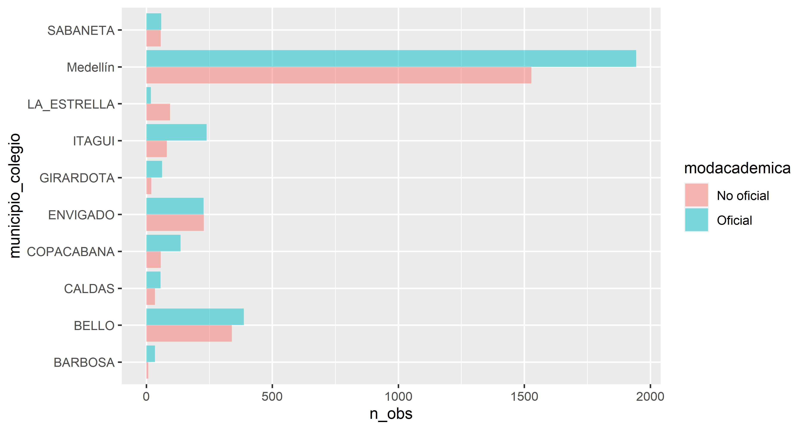

```{r Librerias Necesarias, echo=TRUE, message=FALSE, warning=FALSE}
library(readxl)
library(tidyverse)
library(janitor)
library(magrittr)
library(radiant)
```

Lectura de la Base datos:

```{r}
db <- read_excel("Base de Datos Colegio de Procedencia Matriculados Primer Segundo semestre 2022.xlsx")
```

Limpieza de la Base de datos:

```{r}
db %<>% clean_names()

db %>%  str()

# Variables no representativas:
db$periodo %>% table()
db$cod_sede %>% table()
db$sede %>% table()

db$nivel %>%  table() # Si es representativa?
```

Nueva base de datos con las variables que son representativas:

```{r}
## filter and sort the dataset
db2 <- db %>%
  select(-periodo, -cod_sede, -sede, -nivel)
register("db2", "db")
# dtab(db2, dec = 2, nr = 100) %>% render()
```

Variables que apriori se convierten en factor

```{r}
## change variable type
db2 <- mutate_at(db2, .vars = vars(facultad, tipo_nivel, tipcolegio, modacademica, departamento_colegio, municipio_colegio), .funs = as_factor)
```

Filtros como tipo de depuración:

```{r}
# Municipios del Valle de Aburrá
valle_aburra <- c("Medellín", "BELLO","ENVIGADO", "BARBOSA","ITAGUI", "SABANETA",
                  "LA ESTRELLA", "GIRARDOTA","CALDAS", "COPACABANA")

db2.f <- db2 %>% filter(.,tipo_nivel=="PREGRADO" & departamento_colegio=="ANTIOQUIA"
                        & municipio_colegio %in% valle_aburra)
```

Resumen 1:

```{r fig.width = 8.08, fig.height = 4.31, dpi = 96}
result <- pivotr(
  db2.f, 
  cvars = c("municipio_colegio", "modacademica"), 
  nr = Inf
)
# summary()
dtab(result) %>% render()
res1 <- result$tab
register("res1")
```


